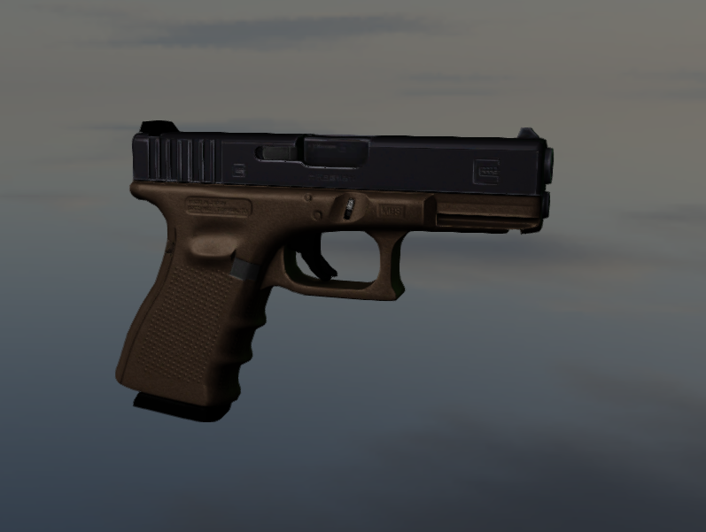

# WebGL2 3D Engine Demo

A simple **3D engine demo** built with **WebGL2**, showcasing advanced rendering techniques and an interactive editor. This project is designed as a playground for exploring modern real-time rendering features in the browser.

## Features

* **Post-processing anti-aliasing**: FXAA, SMAA
* **High Dynamic Range (HDR) rendering**
* **Tonemapping** for realistic color correction
* **Cell Shading / Cartoon-style rendering**
* **Shadow Mapping** for dynamic shadows
* **Model loading** from `.glb` files
* **Fully functional lighting system** (point, directional, spot lights)
* **Built-in editor** for scene manipulation

## Demo

You can view the live demo [here](#linktomysite)

## Getting Started

### Prerequisites

* Modern web browser with **WebGL2 support**

### Installation

1. Clone the repository:

```bash
git clone https://github.com/yourusername/webgl2-3d-engine-demo.git
cd webgl2-3d-engine-demo
```

2. Run it via Live Server

## Usage

* **Load a model**: Use `.glb` files via the editor.
* **Toggle rendering effects**: Switch between FXAA/SMAA and tonemapping in real time.
* **Fully working editor**: Change models in real time.
* **Lighting editor**: Add and adjust lights in the scene.
* **Cell shading**: Enable cartoon-style rendering for stylized visuals.

## Screenshots



## Built With

* [WebGL2](https://developer.mozilla.org/en-US/docs/Web/API/WebGL2RenderingContext) – core rendering API
* JavaScript / HTML / CSS

## Roadmap

* Survive i guess...

## Contributing

1. Fork the project
2. Create your feature branch: `git checkout -b feature/FeatureName`
3. Commit your changes: `git commit -m 'Add some feature'`
4. Push to the branch: `git push origin feature/FeatureName`
5. Open a pull request
